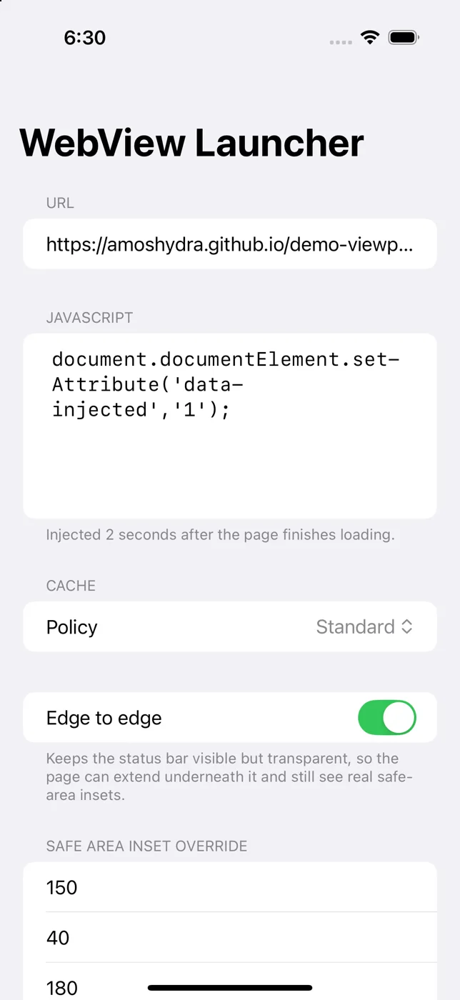
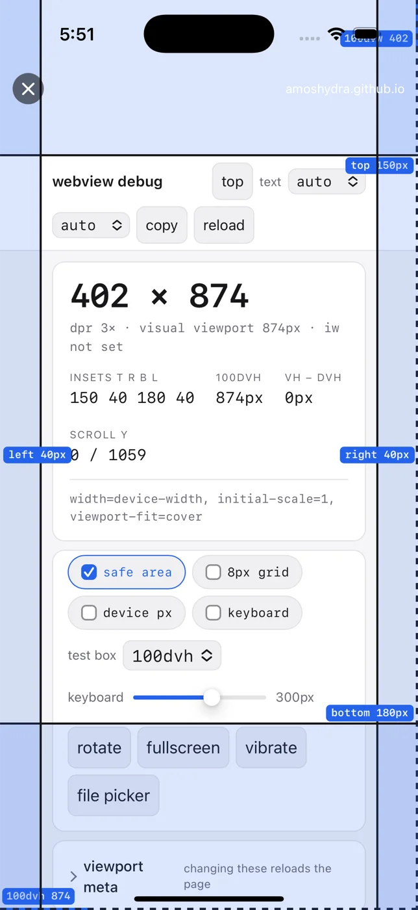
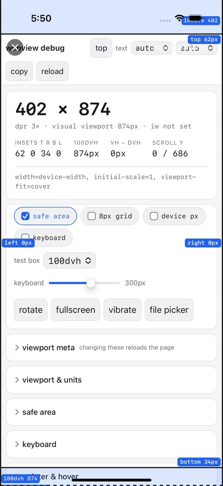
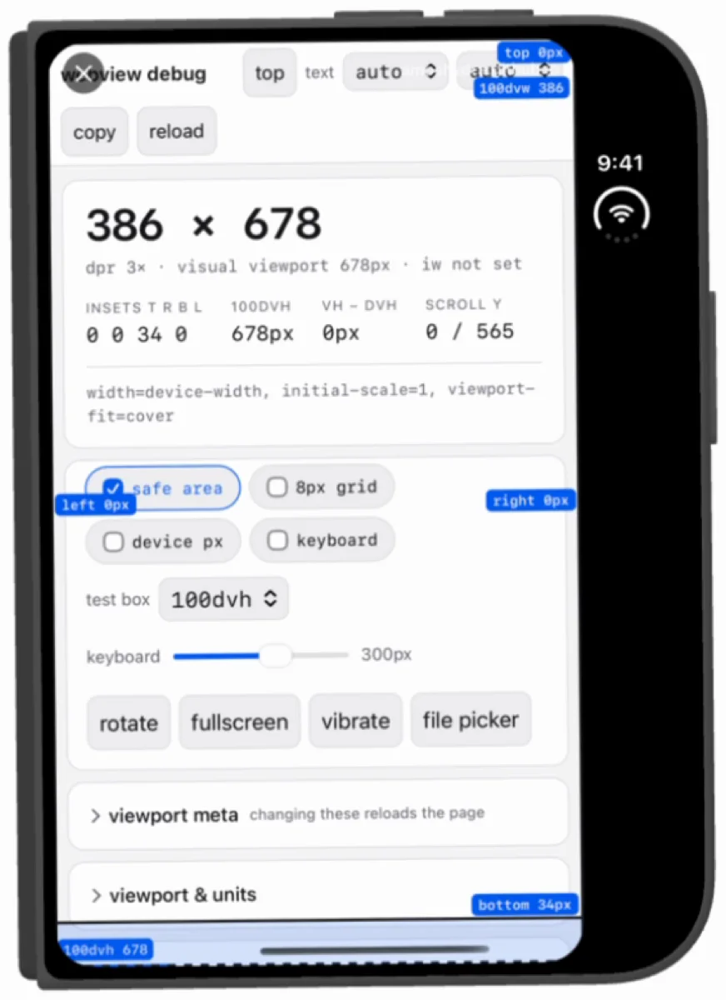
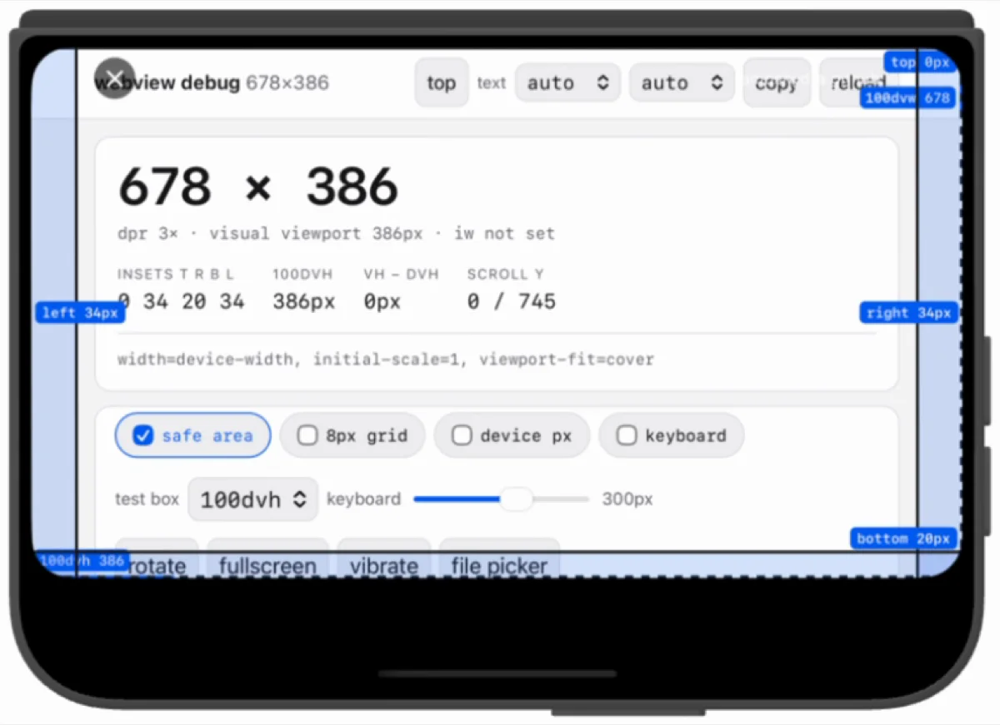
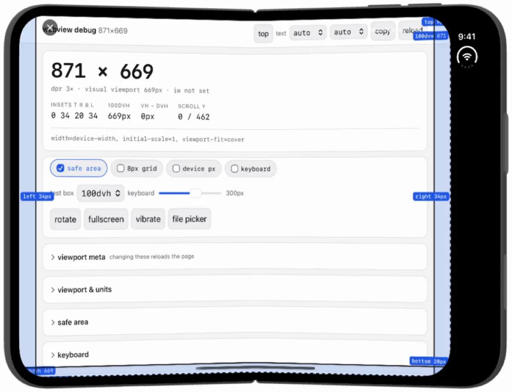

# iOS WebView Launcher

An iOS/SwiftUI port of [`amoshydra/android-webview-launcher`](https://github.com/amoshydra/android-webview-launcher).

A fullscreen WebView launcher with JavaScript injection capabilities.

| Settings | Safe area override applied |
| --- | --- |
|  |  |

## Features

- **Custom URL Input** — enter any http/https address to load
- **JavaScript Injection** — custom JS runs 2 seconds after the page finishes loading
- **Two-Screen Flow** — settings form presents the fullscreen web view
- **Fullscreen Experience** — native close button, host indicator, and a loading spinner; browser chrome hidden
- **Monospace Editor** — code-friendly JavaScript input
- **Cache Control** — standard or ignore-local-cache on load
- **Safe Area Override** — override `env(safe-area-inset-*)` per edge, natively, with no CSS injection
- **Persistence** — URL, JS, and cache policy are remembered across launches
- **Error Surfacing** — JS evaluation failures are shown in a banner rather than failing silently

## Requirements

- Xcode (install from the Mac App Store)
- iOS 17.0+

## Build & Run

The project file is generated from `project.yml` with
[XcodeGen](https://github.com/yonaskolb/XcodeGen), so `WebViewLauncher.xcodeproj`
is disposable and not checked in.

```bash
brew install xcodegen
xcodegen generate
open WebViewLauncher.xcodeproj
```

Then press **Run**. To build from the command line:

```bash
xcodebuild -project WebViewLauncher.xcodeproj -scheme WebViewLauncher \
  -destination 'platform=iOS Simulator,name=iPhone 16' build
```

## Safe area inset override

Ports the original's `InsetAwareWebView` as `InsetOverrideWebView`. The page's
`env(safe-area-inset-top|right|bottom|left)` values are derived from the web view's
own `safeAreaInsets`, so overriding that getter is what makes the page observe the
overridden values. No CSS is injected and the document is never mutated, so pages
reading `env()` directly see the override rather than a doubled-up result.

Fields take a point value per edge; **blank leaves that edge at the real system
value**. Values are not clamped, so a value larger than the real inset pushes
content further in — same as the Android original.

| No override | Override `150/40/180/40` |
| --- | --- |
|  |  |

The real insets on that device are `62/0/34/0`. The page in both shots is
[`amoshydra/demo-viewport`](https://amoshydra.github.io/demo-viewport/?fit=cover),
which reports what it observes; the numbers are its own readout, not this app's.

### On the iPhone Duo

The Duo is Apple's first foldable, and its safe area is a different shape from
every other iPhone — and it changes shape twice. No override set:

| Outer, portrait | Outer, landscape | Unfolded, inner display |
| --- | --- | --- |
|  |  |  |
| `0 0 34 0` | `0 34 20 34` | `0 34 20 34` |

The top is `0` in all three, where a Pro reports `62` for its notch. And the 34pt
home indicator that sits entirely at the bottom in portrait splits into 34pt on
each side with 20pt at the bottom once rotated or unfolded — so anything sizing
a footer off `env(safe-area-inset-bottom)` is wrong in two of the three states.

These three are frames from a screen recording rather than `simctl io screenshot`:
rotation and folding could not be driven headlessly.

**Verified working** on the iOS Simulator, iOS 18.6 → 27.1:

| Runtime | Device | Overrides | Blank → real values |
|---|---|---|---|
| 18.6 | iPhone 16 Pro | `150/40/180/40` ✓ | `62/0/34/0` ✓ |
| 26.5 | iPhone 17 Pro | `150/40/180/40` ✓ | — |
| 27.0 | iPhone 17 Pro | `111/44/222/33` ✓ | `62/0/34/0` ✓ |
| 27.0 | iPhone 18 Pro | `111/44/222/33` ✓ | `62/0/34/0` ✓ |
| 27.1 | iPhone Duo | `150/40/180/40` ✓ | — |

Raw measurements, including two false negatives and the method, are in
[`Tests/SAFE_AREA_RESULT.md`](Tests/SAFE_AREA_RESULT.md). A longer write-up with
the Android comparison is at
[the blog post](https://amoshydra.github.io/blog/posts/webview-safe-area-inset-override/).

### Three conditions

Miss any one and every edge silently reads `0px`:

1. **`viewport-fit=cover` in the document.** WebKit reports `0` for every
   `env(safe-area-inset-*)` without it, and no native change can alter that. This
   is the one genuine behavioural gap versus Android, whose WebView (M136+)
   populates them from `WindowInsets` with no opt-in.
2. **`scrollView.contentInsetAdjustmentBehavior == .never`.** Any other value lets
   UIKit inset the scroll view, which suppresses the page's safe-area reporting
   entirely.
3. **Set the override before the first layout pass** — in `makeUIView`, not from a
   later callback.

### Do not measure this with a single read

WebKit bug 191872 — `env(safe-area-inset-*)` is zero on first load and only
becomes correct "at some arbitrary time after the web view is initialized". A
single read in `webView(_:didFinish:)` is therefore *guaranteed* to see zeros on
some configurations and will make a working override look broken.

How many samples it takes varies unpredictably — the same iPhone 17 Pro needed two
on iOS 27.0 and one on 26.5. The `ENV_PROBE=1` harness samples 12 times over ~6s
and records every distinct reading; use it rather than reading once.

```bash
SIMCTL_CHILD_ENV_PROBE=1 xcrun simctl launch <UDID> com.amoshydra.iosapp
C=$(xcrun simctl get_app_container <UDID> com.amoshydra.iosapp data)
cat "$C/Documents/env-probe.txt"
```

The override is only meaningful while **Edge to edge** is on, mirroring the
Android original — in immersive mode the insets are consumed before the web view
sees them.

## Architecture

```
SettingsView (Form)
  - URL Input: https://example.com
  - JavaScript: alert('Hello!');
  - Cache: Standard
  - Edge to edge: on
  - Safe area override: 150 / 40 / 180 / 40
  - [Launch WebView]
         |
         v
WebViewScreen (fullscreen InsetOverrideWebView)
  - Loads specified URL
  - Waits 2 seconds
  - Evaluates JavaScript
```

| Android | iOS |
| --- | --- |
| `SettingsActivity` | `SettingsView` (SwiftUI `Form`) |
| `MainActivity` | `WebViewScreen` + `WebViewRepresentable` |
| `WebView` | `WKWebView` |
| `InsetAwareWebView` | `InsetOverrideWebView` |
| `onApplyWindowInsets` | `safeAreaInsets` (getter override) |
| `evaluateJavascript` | `evaluateJavaScript(_:completionHandler:)` |

## Notes

`NSAllowsArbitraryLoads` is enabled in `Info.plist` because the app's purpose is
to load arbitrary user-supplied URLs, including plain `http` and local-network
addresses. This weakens App Transport Security for the whole app — do not ship
this configuration to the App Store without reviewing it.

## License

MIT — see [LICENSE](LICENSE). Original work © 2026 amoshydra.
